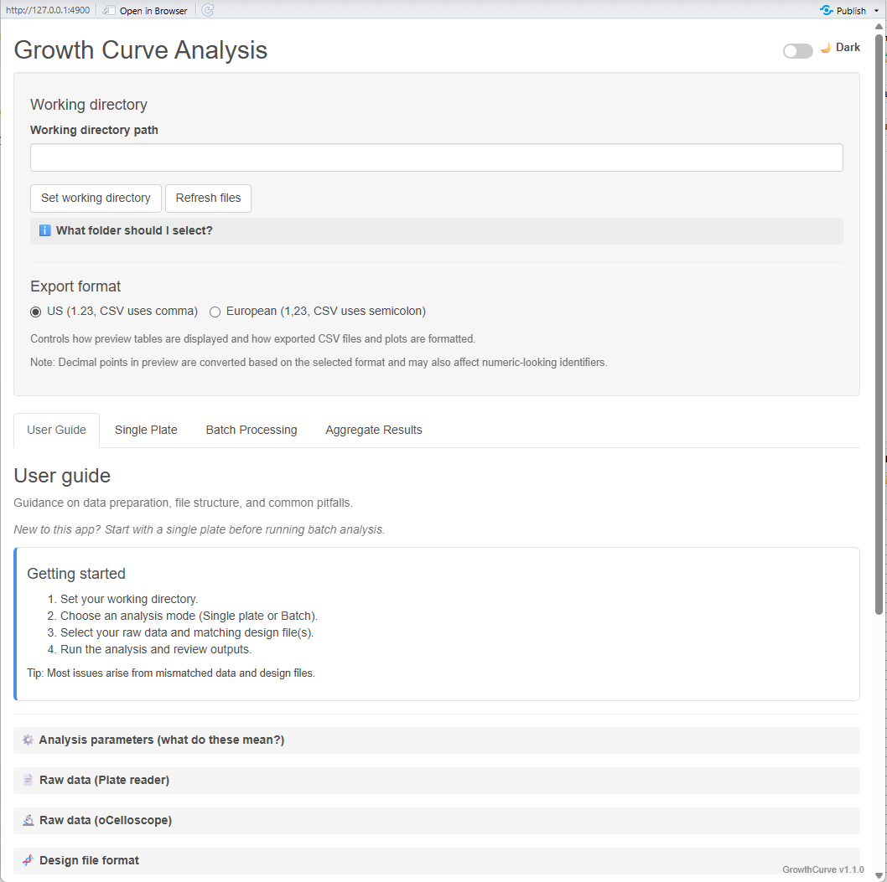

# Growth Curve Analysis Application

An interactive Shiny application for analyzing microbial growth curves from **plate reader** and **oCelloscope** instruments.

GrowthCurve provides a structured workflow for importing raw growth data, applying standardized growth-rate analysis, generating diagnostic plots, and exporting tidy results for downstream statistical analysis.

## Quick Start

Run the following commands in an R session (typically in RStudio) to launch the app:

```r
if (!requireNamespace("pak", quietly = TRUE)) {
  install.packages("pak")
}
pak::pak("jordanmbarrows/growthcurve@*release")

library(growthcurve)
run_growthcurve()
```

## Installation

### Install from GitHub

#### Latest stable release

```r
# Install pak if needed
if (!requireNamespace("pak", quietly = TRUE)) {
  install.packages("pak")
}

pak::pak("jordanmbarrows/growthcurve@*release")
```

#### Latest development version

Use this only if you want the newest unreleased changes and are comfortable testing development code.

```r
pak::pak("jordanmbarrows/growthcurve")
```

### Local installation from source

1. Clone or download the repository

```bash
git clone https://github.com/jordanmbarrows/growthcurve.git
cd growthcurve
```

2. In R/RStudio:

```r
devtools::install()
```

## Usage

Once installed, launch the application with:

```r
library(growthcurve)
run_growthcurve()
```

This opens the interactive Shiny app.

## Features

- **Single Plate Analysis**  
  Explore one dataset interactively with full diagnostic plotting

- **Batch Processing**  
  Process multiple plates with optional parallel execution and cancellation support

- **Results Aggregation**  
  Combine `plate_tidy.csv` outputs from multiple runs into a single dataset

- **Flexible Input Parsing**  
  Supports both **block** and **wide** raw-data layouts for plate reader input

- **Flexible Design Files**  
  Supports both **block** and **wide** experimental design file formats

- **Interactive File Preview**  
  Preview raw data and design files before analysis

- **Quality Control**  
  Automatic QC flagging for problematic wells

- **Regional CSV Support**  
  Compatible with both **US** and **European** CSV formats

- **Instrument Support**  
  Works with both **plate reader** and **oCelloscope** data

## Screenshot

Example interface for analyzing microbial growth curves:



## Data Requirements

### Raw Data Files

- CSV format (comma- or semicolon-delimited)
- Plate reader input may be in **block** or **wide** format
- oCelloscope input must contain a valid `TANormalized` block
- Raw data files should be opened and re-saved in Excel before use to normalize CSV formatting

### Design Files

- CSV format (comma- or semicolon-delimited)
- May be in **block** or **wide** format
- Must include `Well_type` as the first variable
- Additional design variables (e.g., strain, treatment, biological replicate, plate ID) are supported

### Templates

The app includes downloadable block- and wide-format design file templates for both **US** and **EU** CSV conventions.

See the **User Guide** tab in the app for full format specifications and examples.

## Basic Workflow

1. Launch the app with `run_growthcurve()`
2. Set your working directory in the app
3. Choose an analysis mode:
   - Single Plate
   - Batch Processing
   - Aggregate Results
4. Select your raw data and matching design file(s)
5. Adjust analysis parameters
6. Run the analysis
7. Review plots and export results

## Outputs

Each analysis can export:

- `plate_report.pdf` — diagnostic plots
- `plate_tidy.csv` — tidy per-well summary results
- `plate_od.csv` — tidy per-well cleaned OD data for easy plotting of curves after analysis
- `Analysis_arguments.csv` — analysis metadata
- `batch_run_summary.csv` — batch status summary (batch mode only)

Aggregate Results exports:

- `combined_tidy_YYYYMMDD_HHMMSS.csv`

## System Requirements

- R >= 4.1.0
- Required package dependencies must be installed
- If dependencies are missing, the app will stop at startup with a descriptive error message

## License

MIT License - See LICENSE file for details

## Author

Jordan Mark Barrows

## Acknowledgements

This application relies heavily on the `{gcplyr}` R package for growth curve analysis.  
We gratefully acknowledge the developers of `{gcplyr}` for their work implementing the core analysis methods used here.

## Citation

If you use this tool, please cite the underlying package:

> Blazanin, M. gcplyr: an R package for microbial growth curve data analysis.  
> BMC Bioinformatics 25, 232 (2024).  
> https://doi.org/10.1186/s12859-024-05817-3

A BibTeX entry for LaTeX users is:

```bibtex
@Article{,
  title = {gcplyr: an R package for microbial growth curve data analysis},
  author = {Michael Blazanin},
  year = {2024},
  doi = {10.1186/s12859-024-05817-3},
  journal = {BMC Bioinformatics},
  volume = {25},
  number = {232},
  note = {version 1.12.0},
}
```

## Support

For issues, bug reports, or feature requests, please open an issue on GitHub.
